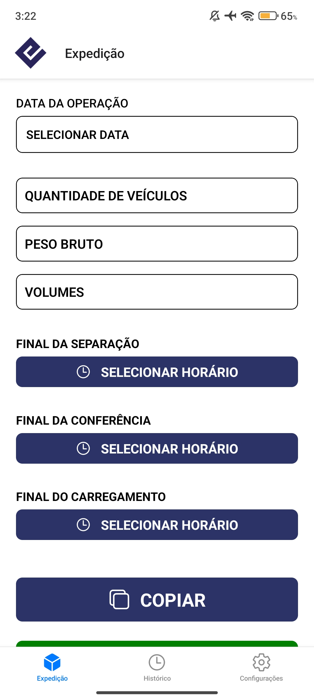
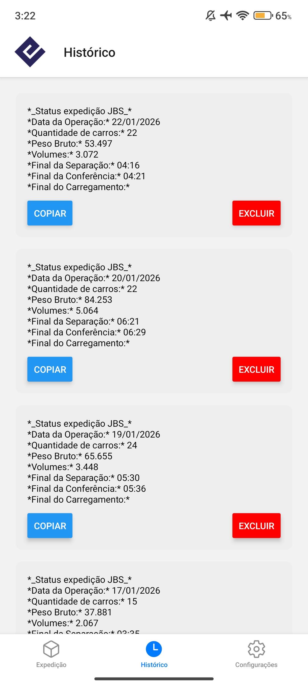

# 📱 Sistema de Mensagens da Operação

Aplicativo mobile desenvolvido em **React Native** com foco no envio e visualização de mensagens operacionais, priorizando simplicidade, agilidade e persistência local dos dados.

Projeto desenvolvido a partir de uma necessidade real da operação.

---

## 🎯 Objetivo do Projeto

O objetivo deste projeto é centralizar mensagens importantes da operação em um único lugar, permitindo que informações sejam enviadas, armazenadas e consultadas de forma rápida, mesmo após o fechamento do aplicativo.

---

## ✨ Funcionalidades

- 📤 Envio de mensagens operacionais
- 📥 Listagem de mensagens salvas
- 💾 Persistência local utilizando AsyncStorage
- 📱 Interface simples e objetiva
- ♻️ Reutilização de componentes

---

## 📸 Screenshots

Tela de envio

  

   
   

Lista de mensagens

  

---

## 🎥 Demonstração em vídeo

[▶️ Assistir ao vídeo](https://www.youtube.com/shorts/jTBPTxg1H48)

---

## 🛠️ Tecnologias Utilizadas

- React Native
- JavaScript
- AsyncStorage
- Componentização funcional
- Estado local

---
